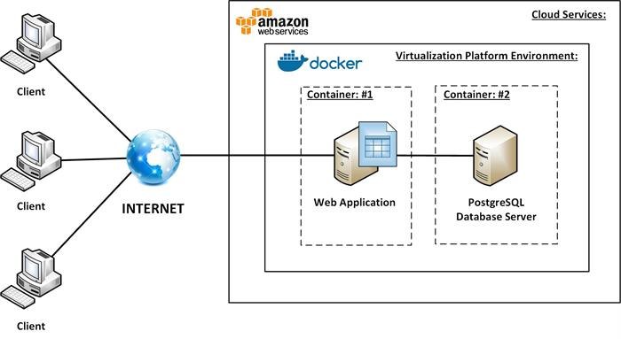

# docker-notes

## What is Docker?



## Important Linux Information for Docker

### Linux Distributions

### Managing Linux Packages

```bash
apt update 
apt list 
apt install nano
apt remove nano
```

### Managing Environment Variables

```bash
printenv           # to list all variables and their value
printenv PATH      # to view the value of PATH
echo $PATH         # to view the value of PATH
export name=bob    # to set a variable in the current session
```

### Managing Users and Groups

```bash
useradd -m john    # to create a user with a home directory
adduser john       # to add a user interactively
usermod            # to modify a user
userdel            # to delete a user

groupadd devs      # to create a group 
groups john        # to view the groups for john
groupmod           # to modify a group
groupdel           # to delete a group
```

### Managing File Permissions

```bash
comchmod u+x deploy.sh    # give the owning user execute permission
chmod g+x deploy.sh    # give the owning group execute permission
chmod o+x deploy.sh    # give everyone else execute permission
chmod ug+x deploy.sh   # to give the owning user and group execute permission
chmod ug-x deploy.sh   # to remove the execute permission from the owning user and group
```

## Dockerfiles

```docker
FROM         # to specify the base image 
WORKDIR      # to set the working directory
COPY         # to copy files/directories
ADD          # to copy files/directories
RUN          # to run commands 
ENV          # to set environment variables
EXPOSE       # to document the port the container is listening on
USER         # to set the user running the app
CMD          # to set the default command/program
ENTRYPOINT   # to set the default command/program
```

## Choosing a Suitable Base Image

## Excluding Files and Directories with `.dockerignore`

## Optimizing Builds

## Removing Docker Images

```docker
docker container rm <containerID> 
docker rm <containerID> 
docker rm -f <containerID>        # to force the removal
docker container prune            # to remove stopped containers
```

## Tagging Docker Images

## Sharing Docker Images

## Saving and Loading Images