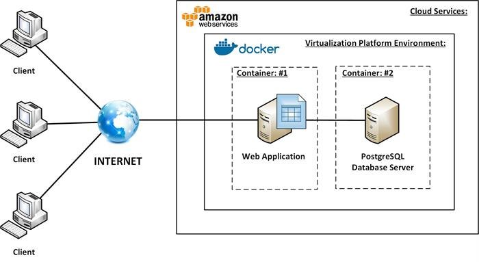
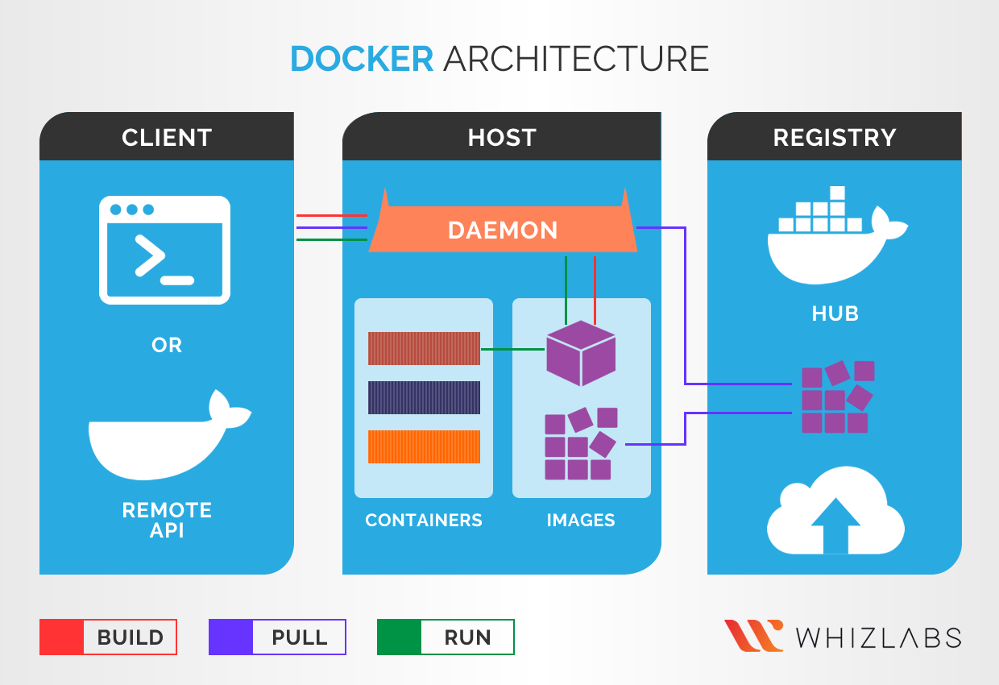
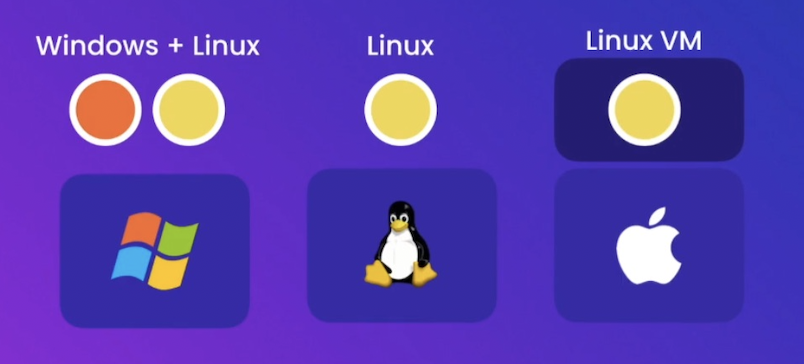
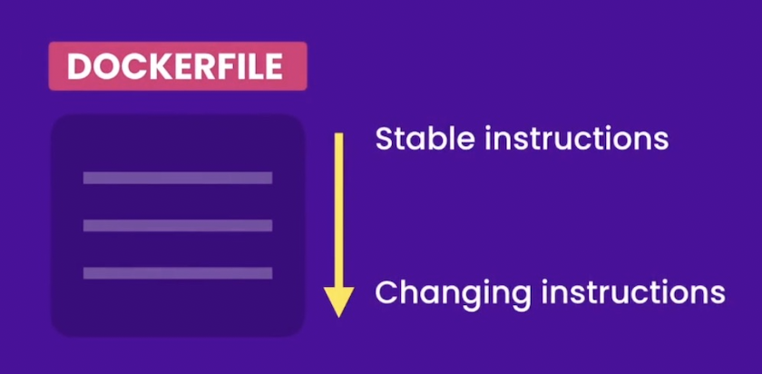

# docker-notes

Some tips / things of notes for myself while I'm learning Docker

## What is Docker?


Docker is a platform and tool designed to make it easier to create, deploy, and run applications using containers. Containers allow developers to package an application with all of its dependencies — such as libraries, frameworks, and other components — into a standardized unit for development, shipment, and deployment. 


It promotes consistency, portability, and scalability across different environments, from development laptops to production servers and cloud platforms. As a result, Docker has become an essential tool in modern software development workflows, enabling faster development cycles, improved collaboration, and more efficient resource utilization.



## Docker Containers vs Virtual Machines


Virtual Machines:
- Each VM needs a full-blown OS
- Slow to start 
- Resource intensive

Containers:
- Allow running multiple apps in isolation
- Are lightweight
- Use OS of the host
- Start quickly
- Need less hardware resources

## How Docker Works



1. The client sends a REST API request to the server (aka the Docker Engine)
2. Docker can then create a container from a docker image
    - A container is just a process (a special kind of process with its own filesystem)

### How Docker Runs 

Docker works slightly differently on Windows, Linux, and macOS due to the underlying architecture of each operating system. Let's break it down:

- Linux: Docker was initially designed to run natively on Linux. On Linux systems, Docker uses the host operating system's kernel and namespaces to create isolated containers. This means that Docker containers on Linux share the same kernel as the host system but have their own isolated filesystem, processes, and network interfaces. Docker Engine, which is the underlying runtime for Docker, communicates directly with the Linux kernel through system calls.

- Windows: Docker on Windows uses a lightweight virtual machine (VM) to run Linux containers. This is because Windows and Linux have different kernel architectures, and Docker relies on Linux kernel features for containerization. To bridge this gap, Docker Desktop for Windows includes a small Linux VM called a "MobyLinuxVM" (using Hyper-V or WSL 2 backend) that runs a minimal Linux distribution. This VM hosts the Docker Engine and manages Linux containers. However, Docker also supports Windows containers, which run natively on Windows and do not require the Linux VM. Windows containers use Windows-specific kernel features for isolation.

- macOS: Similar to Windows, macOS doesn't natively support Linux containers due to differences in kernel architecture. Docker on macOS also uses a lightweight Linux VM (HyperKit) to run Linux containers. Docker Desktop for Mac includes a component called "LinuxKit" that creates a small Linux environment running on the macOS host. This Linux environment hosts the Docker Engine and manages Linux containers. As with Windows, Docker also supports running native Windows containers on macOS using a Windows VM, which is included in Docker Desktop.



## Docker Images

A Docker image serves as the blueprint for creating Docker containers. It is a lightweight, standalone, and executable package that contains everything needed to run a piece of software. This includes:
- A cut-down OS
- A runtime environemnt (e.g. Node)
- Application files
- Third-party libraries
- Configuration files
- Environmental variables

### Docker Image Commands

```bash
docker build -t <name> .
# Builds a Docker image from a Dockerfile in the current directory
# and tags it with the specified name (<name>).

docker images
# Lists all Docker images stored locally on the system.
# This is a deprecated command, and it's recommended to use
# `docker image ls` instead.

docker image ls
# Lists all Docker images stored locally on the system.
# This is the preferred command for listing Docker images,
# replacing the deprecated `docker images`.
```

## Running a Docker Container

```bash
docker start <containerID>
docker stop <containerID> 
```

## Entering a Docker Container Interactively


You can enter Docker containers interactively to inspect the virtual environment. Here is how it is done:

1. First, start a container from the Docker image you want to enter. You can do this using the docker run command. For example:

```bash
docker run -it <image_name_or_id> /bin/bash
```

Replace `<image_name_or_id>` with the name or ID of the Docker image you want to run. The `-it` flag is used to start the container in interactive mode and allocate a pseudo-TTY for the session. `/bin/bash` specifies the command to run inside the container, which in this case is the Bash shell. You can replace `/bin/bash` with the command appropriate for the shell available in the image (e.g., `/bin/sh`).

2. If the container is already running, you can use the `docker exec` command to enter it interactively. For example:

```bash
docker exec -it <container_name_or_id> /bin/bash
```

Replace `<container_name_or_id>` with the name or ID of the running container you want to enter. Again, `/bin/bash` specifies the command to run inside the container.

After running either of these commands, you should be dropped into an interactive shell session within the Docker container, allowing you to execute commands and interact with the container's filesystem and environment. 

### The Interactive Docker Container Prompt

The interactive Docker container prompt typically appears as something like `root@container_id:/app#` when you enter an interactive session within a Docker container. Here's a breakdown of its components:

#### User and Hostname:

- `root`: This indicates the username of the current user inside the container. In this case, it's "root," which is the superuser or administrator account in Unix-like operating systems.
- `@`: This symbol separates the username from the hostname.
- `container_id`: This is the unique identifier of the Docker container. It could also be the container's name if you provided one when creating the container.

#### Current Directory:

- `/app`: This represents the current working directory inside the container. In this example, the prompt indicates that you are currently in the /app directory.
Prompt Symbol:

- `#`: This symbol indicates that the user is operating with root privileges. In Unix-like systems, the dollar sign `$` typically indicates a _regular user_, while the pound sign `#` indicates the _root user_ or _superuser_.

So, when you see a prompt like `root@container_id:/app#`, it means that you are logged in as the root user inside a Docker container, currently working in the /app directory, and have superuser privileges, allowing you to execute commands with elevated permissions.

> [!WARNING]
> It is typically dangerous to give users root privileges inside a container (despite this being the default Docker behaviour). If you are building an app, it is advised fix the user and group permissions in the Dockerfile.

### Exiting Interactive Docker Containers

When you're finished, you can exit the interactive session by typing `exit` and pressing Enter.

## Dockerfiles

```Dockerfile
FROM         # to specify the base image 
WORKDIR      # to set the working directory
COPY         # to copy files/directories
ADD          # to copy files/directories
RUN          # to run commands 
ENV          # to set environment variables
EXPOSE       # to document the port the container is listening on
USER         # to set the user running the app
CMD          # to set the default command/program
ENTRYPOINT   # to set the default command/program
```

### `FROM`

The `FROM` instruction in Dockerfile specifies the base image from which you want to build your Docker image. It is typically the first instruction in a Dockerfile and defines the starting point for the build process.

> [!CAUTION]
> If not specified, by default `FROM` pulls the latest image. 
> 
> For example:
> 
> `FROM node`
>
> is equivalent to
> 
> `FROM node:latest`
>
> **You should never do this!** Upon successsive builds of your docker image the environment might change. 
> 
> Instead, use a specific version for your base image. 
> 
> Example:
> 
> `FROM node:14.16.0-alpine3.13`

By default, the image registry that docker uses is Dockerhub. However, you can pull images from any registry, you just need their full url. For example, to pull an image from Microsoft Container Registry, you can use:

```Dockerfile
FROM mcr.microsoft.com/dotnet/core/sdk:3.1
```

However, you should never just copy a URL of an image from a website and use it in your Dockerfile. This is because the URL can change or the version can change so always do your research and make sure the image URL you put in your Dockerfile is the correct one.

### `WORKDIR`

The `WORKDIR` instruction in a Dockerfile sets the working directory for any subsequent `RUN`, `CMD`, `ENTRYPOINT`, `COPY`, and `ADD` instructions. It allows you to specify the directory where commands will be executed within the Docker container.

- If the directory specified in `WORKDIR` does not exist, Docker will create it for you.
- If multiple `WORKDIR` instructions are specified in a Dockerfile, only the last one will take effect.
- Paths specified in `WORKDIR` are relative to the previous `WORKDIR` or to the Dockerfile's directory if no previous `WORKDIR` is specified.
- You can use both absolute and relative paths in the `WORKDIR` instruction.

### `COPY`

The `COPY` instruction in a Dockerfile copies files or directories from the Docker host's filesystem into the filesystem of the Docker image being built. It allows you to add files from your local machine or from a directory on the Docker host into the Docker image during the build process.

- If the source is a file, the destination must be a directory. If the source is a directory, the destination can be a directory or a file.
- You can specify multiple source files or directories, and they will all be copied into the destination directory.
    - When using `COPY` with more than one source file, the destination must be a directory and end with a `/` (or `\`). Example: `/app` must be `/app/`.

> [!NOTE]
> 
> A common pattern is 
> 
> ```Dockerfile
> WORDIR /app
> COPY . .
> ```
>
> This copies all files and directories from the Docker host's current directory (the directory containing the Dockerfile) into the `/app` directory within the Docker container. The first `.` represents the source directory on the Docker host, and the second `.` represents the destination directory within the Docker container.


#### Relative Paths:

- Paths specified in the `COPY` instruction are relative to the build context, which is typically the directory containing the Dockerfile.
- The build context is sent to the Docker daemon when you run the docker build command, and the paths specified in the `COPY` instruction are resolved relative to this build context.

#### Permissions:

- When files are copied into the Docker image, they are copied with the same permissions and ownership as on the Docker host. This means that the user and group ownership of the files will be preserved.
- You can use the `--chown` option with `COPY` to change the ownership of the copied files in the Docker image.

### `ADD`

The `ADD` instruction in a Dockerfile copies files, directories, or remote URLs from the Docker host's filesystem or from a URL into the filesystem of the Docker image being built. It's similar to the `COPY` instruction but with additional capabilities.

#### Automatic Extraction:

- If the source is a compressed archive (such as a `.tar`, `.tar.gz`, `.tgz`, `.tar.bz2`, `.tbz2`, .`tar.xz`, `.txz`, `.zip`, `.gz`, `.bz2`, `.xz`, or `.Z` file), `ADD` will automatically extract it into the destination directory in the Docker image.
- This automatic extraction feature makes `ADD` convenient for adding compressed files or archives into a Docker image and automatically extracting them during the build process.

#### Remote URLs:

- If the source is a remote URL, `ADD` will download the content from the URL and copy it into the Docker image.
- This feature allows you to directly add files from the internet into your Docker image during the build process.

#### Permissions:

- Similar to the `COPY` instruction, when files are copied or downloaded into the Docker image using `ADD`, they are copied with the same permissions and ownership as on the Docker host.
- You can use the `--chown` option with `ADD` to change the ownership of the copied files in the Docker image.

### `RUN`

The `RUN` instruction in a Dockerfile executes commands within the Docker image during the build process. You can use it to execute any command that you would normally run in a terminal within the Docker image. It's a fundamental command that allows you to install packages, update software, create directories, or perform any other actions necessary to configure the environment inside the Docker container.

#### Layer creation

Each `RUN` command creates a new layer in the Docker image. This means that changes made by one `RUN` command are committed to the image and become available to subsequent `RUN` commands. This layering mechanism ensures that Docker can efficiently cache and reuse intermediate images during the build process.

Since each `RUN` command creates a new layer, it's essential to clean up any temporary files or dependencies that are no longer needed after each command to avoid bloating the image size unnecessarily. This can be done using additional `RUN` commands to remove files or using the `&&` operator to chain cleanup commands with the main command.

> [!NOTE]
> It's good practice to combine multiple commands into a single `RUN` instruction when possible, using shell chaining (`&&`) to execute them sequentially. This helps minimize the number of layers created in the image, reducing its size.

`RUN` supports both shell form and exec form. 

#### Shell form 

In shell form, commands are executed using the default shell specified in the Dockerfile (`/bin/sh -c` on Linux-based images). 

Example:    

```Dockerfile
RUN apt-get update && \
    apt-get install -y \
    package1 \
    package2
```

#### Exec form 

In exec form, commands are executed directly without a shell.

Example:    

```Dockerfile
RUN ["apt-get", "update"]
RUN ["apt-get", "install", "-y", "package1", "package2"]
```

> [!NOTE]
> Exec form is usually preferred 
> 
> (However see below for cases where it isn't)

#### Which is better? Shell form or Exec form?

Usually, exec form is preferred for clarity and avoids issues with shell parsing.

The exec form is parsed as a JSON array, which means that you must use double-quotes (`“`) around words not single-quotes (`‘`).

Unlike the shell form, the exec form does not invoke a command shell. This means that normal shell processing does not happen. For example, `CMD [ "echo", "$HOME" ]` will not do variable substitution on `$HOME`. If you want shell processing then either use the shell form or execute a shell directly, for example: `CMD [ "sh", "-c", "echo $HOME" ]`. When using the exec form and executing a shell directly, as in the case for the shell form, it is the shell that is doing the environment variable expansion, not Docker.

However, **you cannot chain together commands in the exec form**.

`&&` is a function of the shell, which is used to chain commands together. In fact, when you use this syntax in a Dockerfile, you are actually leveraging the shell functionality.

If you want to have multiple commands with the exec form, then you have do use the exec form to invoke the shell as follows

```Dockerfile
RUN ["sh", "-c", "addgroup app && adduser -S -G app app"]
```

In this case, it is actually **disadvantagous** to use the exec form because: 
1. You have to explicitely specify the shell
2. You have to take care of possibly escaping quotes
3. You cannot split it into multiple lines for easier readability

In this case, just using the shell form would be much better:

```Dockerfile
RUN addgroup app && \
    adduser -S -G app app
```


### `ENV`

The `ENV` instruction in a Dockerfile sets environment variables within the Docker image. It allows you to define key-value pairs that can be referenced by subsequent commands or used by applications running inside the container. `ENV` is particularly useful for configuring software with environment-specific settings or for providing runtime parameters to applications.

The `ENV` instruction follows a simple syntax of `ENV <key> <value>`. Multiple variables can be set in a single `ENV` instruction by separating them with spaces or by using multiple `ENV` instructions.

Example:

```Dockerfile
ENV DATABASE_HOST=db.example.com \
    DATABASE_PORT=5432
```

#### Benefits

1. **Configuration Management:** `ENV` facilitates managing configuration settings separately from the application code, making it easier to maintain and update environment-specific variables.

2. **Portability:** By using environment variables, Docker images become more portable across different environments without needing to modify the underlying application code.

3. **Consistency:** Standardizing environment variables with `ENV` ensures consistency across deployments, reducing the chances of configuration errors.

4. **Security:** Sensitive information, such as passwords or API keys, can be securely passed as environment variables rather than being hard-coded into the Dockerfile.

#### Best Practices

1. **Use Descriptive Names:** Choose clear and descriptive names for environment variables to enhance readability and maintainability.

2. **Immutable Variables:** Treat environment variables as immutable; avoid modifying them within the Dockerfile or container runtime to maintain predictability.

3. **Clear Documentation:** Document the purpose and usage of each environment variable either within the Dockerfile itself or in accompanying documentation.

Example:

```Dockerfile
ENV APP_PORT=8080 \
    DB_HOST=localhost \
    DB_PORT=5432
```

In this example, three environment variables (`APP_PORT`, `DB_HOST`, and `DB_PORT`) are defined with default values. These variables can then be referenced within the Dockerfile or accessed by the application running inside the container.

### `EXPOSE`

The `EXPOSE` instruction exposes a port for your app.

When you launch an application outside of Docker, you will usually start a development server on something like `localhost:3000` where `localhost` refers to the loopback network interface of the local machine, which is typically assigned the IP address `127.0.0.1`. This address is used to access services running on the same machine that the request originated from. The `:3000` part is called the *port number*. Ports are used to differentiate between different services or processes running on the same machine. In this context, `:3000` indicates that the service or process listening on port 3000 is being accessed. When combined, `localhost:3000` refers to a service running on the local machine, specifically on port 3000.

However, if you run this application inside a Docker container, port `:3000` will be open on the **_container_**, not on the host. 

So on the same machine you can have multiple containers running the same image. All these containers will be listening to port `:3000`. **However, the port `:3000` on the host is not going to be automatically mapped to these containers.**

For example, you might run a React app inside a Docker container and see this...

```
Starting the development server...

Compiled successfully!

You can now view operator-admin in the browser.

  Local:            http://localhost:3000
  On Your Network:  http://YOUR-LOCAL-IP-ADDRESS:3000

Note that the development build is not optimized.
To create a production build, use npm run build.
```

...And then try to access the app through `http://localhost:3000`. You will not be able to access the app through this address because the app is started on port `:3000` of the **container**, **not the localhost**.

To do this, you can tell your container which port your app will be listening on:

```Dockerfile
EXPOSE 3000
```

> [!WARNING]
> The `EXPOSE` does not automatically publish the port on the host. It is just a form of documentation to tell us this container will eventually listen on port 3000. So later when you properly run this application inside a Docker container, you know that you should map a port on the host to port 3000 on the container. 

> [!TIP]
> You can map a port on the host to the port on these containers in the Dockerfile.


### `USER`

The `USER` instruction in a Dockerfile sets the user or UID (User Identifier) that the subsequent instructions in the Dockerfile will run as. It allows you to specify the user context under which the commands in the image will be executed. This can be particularly useful for enhancing security and minimizing potential risks associated with running processes as the root user. Remember, by default, Docker runs the application as the root user which is behaviour you normally don't want.

Example:

```Dockerfile
RUN addgroup appuser && \
    adduser -S -G appuser appuser
USER appuser
RUN mkdir /app && chown appuser:appuser /app
```

In this setup, the user `appuser` is created using the `addgroup` and `adduser` commands, and then the `USER` instruction switches to that user for subsequent commands in the Dockerfile, such as creating a directory and changing its ownership, will be executed under this user's permissions.

> [!NOTE]
> It's good practice to name the apps user `app` or `appuser`.

The `USER` instruction can also accept either a username or a `UID` (User Identifier) and an optional group name or `GID` (Group Identifier). If only a username is provided, Docker will resolve it to a `UID` and `GID`.

Example:

```Dockerfile
USER 1000:1000
```

However, in this case, you would need to ensure that the user with that `UID` and `GID` exists in the system where the Docker container will run.

#### Benefits

1. **Security:** Running containers as non-root users can help mitigate security risks by reducing the impact of potential vulnerabilities in the running processes. It limits the access that a compromised process would have to the host system.

2. **Least Privilege:** By specifying a dedicated user for running container processes, you can adhere to the principle of least privilege, ensuring that containers only have access to resources and permissions necessary for their operation.

3. **Isolation:** Using a separate user for running container processes helps isolate the container's environment from the host system, enhancing containment and minimizing potential conflicts or unintended modifications to host resources.

#### Best Practices

1. **Avoid Running as Root:** Whenever possible, avoid running container processes as the root user. Instead, create and use non-privileged users with limited permissions.

2. **Use Minimal Privileges:** Grant only the necessary permissions to the user specified with USER to minimize the potential impact of security breaches.

3. **Set Appropriate Ownership:** Ensure that files and directories within the container are owned by the appropriate user to prevent permission issues during runtime.

4. **Define the app user early in the Dockerfile:** If you run a lot of commands before setting the user, you are running them as root. This may lead to permission issues down the lines especially when starting your app or using an entrypoint.

For example:

```Dockerfile
FROM node:14.16.0-alpine3.13
WORKDIR /app
COPY . .
RUN npm install
ENV API_URL=http://api.myapp.com/
EXPOSE 3000
RUN addgroup app && adduser -S -G app app
USER app
```

When trying to run your app:

```bash
docker run react-app npm start
```

You might encounter something like:

```
Starting the development server...

Failed to compile.

EACCES: permission denied, mkdir 'app/node_modules/.cache'
```

This is a permissions error because the app user was set at the end and all the previous instructions were set as the root user. 

To fix this, reorder the Dockerfile:

```Dockerfile
FROM node:14.16.0-alpine3.13
RUN addgroup app && adduser -S -G app app
USER app
WORKDIR /app
COPY . .
RUN npm install
ENV API_URL=http://api.myapp.com/
EXPOSE 3000
```

### `CMD`


### `ENTRYPOINT`


## Choosing a Suitable Base Image

The first place you should look for base images from your projects is Dockerhub, found on [hub.docker.com](hub.docker.com).

1. Search for your desired base image. For example, if you are building an app with node.js, type in `node` into the search bar on Dockerhub.
    - Often repositories like the node repository will have hundreds images. The following instructions guide you on which one to pick.
2. Click on **_tags_**.
3. The tags section has a search bar. Here you can search to filter your images. For example, if you want your app built on node version 14, you can type in `14` into the search bar.
4. Now skim through the results. Make sure the image tags are descriptive. For example:
    - `14-buster` is an image that contains node version 14 built on the linux distribution buster. However, this image tag doesn't contain the minor build number, it's just the major version number. Additionally, the size of this image is ~333Mb. This is the compressed size, which is likely 3x smaller than the actual size. so this image is likely one you should **avoid**.
    - `14.16.0-alpine3.13` is an image that contains node 14 built on the linux distribution alpine. This image is very descriptive and contains major build and minor build and patch number and also the major and minor build for the distribution so that looks good. In additon, often we want to use images that are built on top of the alpine distribution because these are smaller and more lightweight and so the size of these images are smaller leading to faster builds. This image is ~40Mb compressed. This is an example of an image that you should probably **use**.
5. So in your Dockerfile, on the first line type:

```Dockerfile
FROM node:14.16.0-alpine3.13
```

> [!NOTE]
> Make sure you also pull the image that is built for your operating system and CPU architecture. 
> 
> When you pull an image, docker will automatically download the right docker image for your OS and CPU architecture

## Excluding Files and Directories with `.dockerignore`

A `.dockerignore` file is used to specify files and directories that should be excluded when building a Docker image. It works similarly to `.gitignore` files in Git, allowing you to define patterns to exclude specific files or directories from being included in the Docker image during the build process.

Example, inside a `.dockerignore` file you can have 

```
node_modules/
```

## Optimizing Builds



## Removing Docker Images

```bash
docker container rm <containerID> 
docker rm <containerID> 
docker rm -f <containerID>        # to force the removal
docker container prune            # to remove stopped containers
```

## Tagging Docker Images

## Sharing Docker Images

## Saving and Loading Images

## Important Linux Information for Docker

### Linux Distributions

Linux distributions, often abbreviated as "distros," are variations of the Linux operating system bundled with different combinations of software packages and configurations. These distributions are built around the Linux kernel and typically include a package management system for installing, updating, and removing software.

Here are some key points about Linux distributions:

- Kernel: The Linux kernel is at the core of all Linux distributions. It provides the essential functionality for interacting with hardware, managing processes, and handling system resources. While the kernel remains consistent across distributions, each distribution may include different kernel versions or patches tailored to specific needs.

- Package Management: Linux distributions typically come with a package management system that simplifies software installation and management. Examples include APT (Advanced Package Tool) used by Debian and Ubuntu, YUM (Yellowdog Updater, Modified) used by Fedora and CentOS, and Pacman used by Arch Linux. These tools allow users to install, update, and remove software packages, as well as resolve dependencies automatically.

- Desktop Environment: Linux distributions often offer a choice of desktop environments, such as GNOME, KDE Plasma, Xfce, LXDE, and Cinnamon. These desktop environments provide graphical user interfaces (GUIs) for interacting with the operating system, including window management, file browsing, and application launching. Users can choose the desktop environment that best suits their preferences and hardware requirements.

- Default Software: Linux distributions come with a set of default software packages, including text editors, web browsers, email clients, media players, and system utilities. The specific selection of software may vary depending on the distribution's target audience and use case. For example, distributions designed for servers may include server-oriented software, while desktop distributions may focus on productivity and multimedia applications.

Popular Linux distributions include Ubuntu, Debian, Fedora, and CentOS

### The Apline Linux distribution

Alpine Linux is a lightweight and security-focused Linux distribution known for its minimalist design, small footprint, and focus on simplicity. Alpine Linux is designed to be lightweight, with a small installation size and minimal resource requirements. It achieves this by using a musl libc (C library) instead of the more common GNU libc (glibc) used in many other Linux distributions. This allows Alpine to have smaller binaries and libraries, resulting in reduced memory usage and faster startup times.

Alpine Linux is widely used as a base image for Docker containers due to its lightweight nature, security features, and container-friendly design. 

Here are things to note about using Alpine Linux as a base image:

1. Alpine Linux does not have the `apt` package manager. Alpine Linux uses the `apk` package manager (Alpine Package Keeper) to manage software packages. `apk` is lightweight, fast, and designed for Alpine's musl libc-based system. It supports features such as package installation, upgrading, removal, and dependency resolution. The Alpine package repositories provide a wide range of pre-built packages, including common software components and libraries.
2. Apline Linux does not use `bash` as the default shell. Instead, you'll likely be interacting with it using `sh`. To use `bash` as the default shell, you can install it with `apk add bash`.

### Managing Linux Packages

- If available, `apt` should be used over `apt-get`
- `apt update` must be called before trying to install a package. It is essential for ensuring that `apt` has the latest information about available packages and their dependencies. 

```bash
apt update 
apt list 
apt install nano
apt remove nano
```

### Managing Environment Variables

```bash
printenv           # to list all variables and their value
printenv PATH      # to view the value of PATH
echo $PATH         # to view the value of PATH
export name=bob    # to set a variable in the current session
```

### Managing Users and Groups

```bash
whoami            # to print the current users name

useradd -m john    # to create a user with a home directory
adduser john       # to add a user interactively
usermod            # to modify a user
userdel            # to delete a user

groupadd devs      # to create a group 
groups john        # to view the groups for john
groupmod           # to modify a group
groupdel           # to delete a group
```

> [!WARNING]
> Some images or Linux distributions may have not have `useradd` or vice versa may not have `adduser`. Be aware of which options are available on your image.

In Linux, each user account can belong to one primary group and zero or more secondary groups/ Here's a breakdown of primary and secondary groups:

#### Primary Group:

- Every user account in Linux is associated with a primary group.
- When a user creates a file or directory, the primary group of the user is typically assigned as the group owner of that file or directory by default.
- The primary group is specified in the user's entry in the `/etc/passwd` file.
- The primary group is identified by its Group ID (GID), which is a numeric value associated with the group.

#### Secondary Groups:

- In addition to the primary group, a user can be a member of multiple secondary groups.
- Secondary groups allow users to access files and resources that belong to those groups.
- Secondary groups are specified in the user's entry in the `/etc/group` file.
- Users can switch to one of their secondary groups temporarily using the newgrp command.
- Secondary groups are identified by their Group IDs (GIDs), which are numeric values associated with the groups.

Here's a summary of the files where primary and secondary group information is stored:

- `/etc/passwd`: This file contains user account information, including the primary group of each user.
- `/etc/group`: This file contains group information, including the names and members of each group, including both primary and secondary groups.


#### Best practice for adding users in Linux

In Linux, when adding a new user, it is best practice to give that user a primary group with the same name as the user.

- For `adduser`
    - use `-S` to create a new system user. System users are good when you don't want to create real users but instead users to just run an application.
    - use `-G` to assign that user to a primary group

Example:

```bash
addgroup app # Create a group called app
adduser -S -G app app # Create a system user called app that belongs to the primary group app

# Or more simply

addgroup app && adduser -S -G app app
```

### Managing File Permissions

```bash
comchmod u+x deploy.sh    # give the owning user execute permission
chmod g+x deploy.sh    # give the owning group execute permission
chmod o+x deploy.sh    # give everyone else execute permission
chmod ug+x deploy.sh   # to give the owning user and group execute permission
chmod ug-x deploy.sh   # to remove the execute permission from the owning user and group
```
