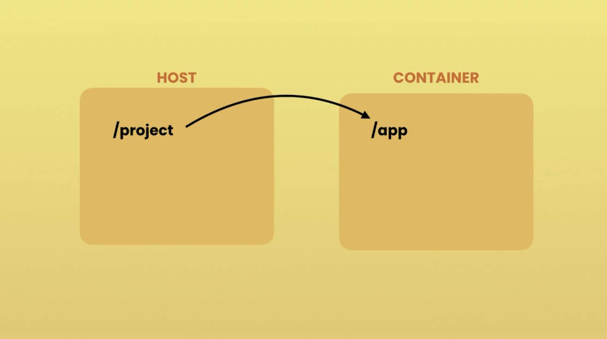

# docker-notes

Some tips / things of notes for myself while I'm learning Docker

## What is Docker?


Docker is a platform and tool designed to make it easier to create, deploy, and run applications using containers. Containers allow developers to package an application with all of its dependencies — such as libraries, frameworks, and other components — into a standardized unit for development, shipment, and deployment.


It promotes consistency, portability, and scalability across different environments, from development laptops to production servers and cloud platforms. As a result, Docker has become an essential tool in modern software development workflows, enabling faster development cycles, improved collaboration, and more efficient resource utilization.


## Docker Containers vs Virtual Machines


Virtual Machines:

- Each VM needs a full-blown OS
- Slow to start
- Resource intensive

Containers:

- Allow running multiple apps in isolation
- Are lightweight
- Use OS of the host
- Start quickly
- Need less hardware resources

## How Docker Works


1. The client sends a REST API request to the server (aka the Docker Engine)
2. Docker can then create a container from a docker image
   - A container is just a process (a special kind of process with its own filesystem)

### How Docker Runs

Docker works slightly differently on Windows, Linux, and macOS due to the underlying architecture of each operating system. Let's break it down:

- Linux: Docker was initially designed to run natively on Linux. On Linux systems, Docker uses the host operating system's kernel and namespaces to create isolated containers. This means that Docker containers on Linux share the same kernel as the host system but have their own isolated filesystem, processes, and network interfaces. Docker Engine, which is the underlying runtime for Docker, communicates directly with the Linux kernel through system calls.

- Windows: Docker on Windows uses a lightweight virtual machine (VM) to run Linux containers. This is because Windows and Linux have different kernel architectures, and Docker relies on Linux kernel features for containerization. To bridge this gap, Docker Desktop for Windows includes a small Linux VM called a "MobyLinuxVM" (using Hyper-V or WSL 2 backend) that runs a minimal Linux distribution. This VM hosts the Docker Engine and manages Linux containers. However, Docker also supports Windows containers, which run natively on Windows and do not require the Linux VM. Windows containers use Windows-specific kernel features for isolation.

- macOS: Similar to Windows, macOS doesn't natively support Linux containers due to differences in kernel architecture. Docker on macOS also uses a lightweight Linux VM (HyperKit) to run Linux containers. Docker Desktop for Mac includes a component called "LinuxKit" that creates a small Linux environment running on the macOS host. This Linux environment hosts the Docker Engine and manages Linux containers. As with Windows, Docker also supports running native Windows containers on macOS using a Windows VM, which is included in Docker Desktop.


## Docker Images

A Docker image serves as the blueprint for creating Docker containers. It is a lightweight, standalone, and executable package that contains everything needed to run a piece of software. This includes:

- A cut-down OS
- A runtime environemnt (e.g. Node)
- Application files
- Third-party libraries
- Configuration files
- Environmental variables

### Docker Image Commands

```bash
docker build -t <name> .
# Builds a Docker image from a Dockerfile in the current directory
# and tags it with the specified name (<name>).

docker images
# Lists all Docker images stored locally on the system.
# This is a deprecated command, and it's recommended to use
# `docker image ls` instead.

docker image ls
# Lists all Docker images stored locally on the system.
# This is the preferred command for listing Docker images,
# replacing the deprecated `docker images`.
```

## Running a Docker Container

```bash
docker start <containerID>
docker stop <containerID>
```

## Entering a Docker Container Interactively

You can enter Docker containers interactively to inspect the virtual environment. Here is how it is done:

1. First, start a container from the Docker image you want to enter. You can do this using the docker run command. For example:

```bash
docker run -it <image_name_or_id> /bin/bash
```

Replace `<image_name_or_id>` with the name or ID of the Docker image you want to run. The `-it` flag is used to start the container in interactive mode and allocate a pseudo-TTY for the session. `/bin/bash` specifies the command to run inside the container, which in this case is the Bash shell. You can replace `/bin/bash` with the command appropriate for the shell available in the image (e.g., `/bin/sh`).

2. If the container is already running, you can use the `docker exec` command to enter it interactively. For example:

```bash
docker exec -it <container_name_or_id> /bin/bash
```

Replace `<container_name_or_id>` with the name or ID of the running container you want to enter. Again, `/bin/bash` specifies the command to run inside the container.

After running either of these commands, you should be dropped into an interactive shell session within the Docker container, allowing you to execute commands and interact with the container's filesystem and environment.

### The Interactive Docker Container Prompt

The interactive Docker container prompt typically appears as something like `root@container_id:/app#` when you enter an interactive session within a Docker container. Here's a breakdown of its components:

#### User and Hostname:

- `root`: This indicates the username of the current user inside the container. In this case, it's "root," which is the superuser or administrator account in Unix-like operating systems.
- `@`: This symbol separates the username from the hostname.
- `container_id`: This is the unique identifier of the Docker container. It could also be the container's name if you provided one when creating the container.

#### Current Directory:

- `/app`: This represents the current working directory inside the container. In this example, the prompt indicates that you are currently in the /app directory.
  Prompt Symbol:

- `#`: This symbol indicates that the user is operating with root privileges. In Unix-like systems, the dollar sign `$` typically indicates a _regular user_, while the pound sign `#` indicates the _root user_ or _superuser_.

So, when you see a prompt like `root@container_id:/app#`, it means that you are logged in as the root user inside a Docker container, currently working in the /app directory, and have superuser privileges, allowing you to execute commands with elevated permissions.

> [!WARNING]
> It is typically dangerous to give users root privileges inside a container (despite this being the default Docker behaviour). If you are building an app, it is advised fix the user and group permissions in the Dockerfile.

### Exiting Interactive Docker Containers

When you're finished, you can exit the interactive session by typing `exit` and pressing Enter.

## Dockerfiles

```Dockerfile
FROM         # to specify the base image
WORKDIR      # to set the working directory
COPY         # to copy files/directories
ADD          # to copy files/directories
RUN          # to run commands
ENV          # to set environment variables
EXPOSE       # to document the port the container is listening on
USER         # to set the user running the app
CMD          # to set the default command/program
ENTRYPOINT   # to set the default command/program
```

### `FROM`

The `FROM` instruction in Dockerfile specifies the base image from which you want to build your Docker image. It is typically the first instruction in a Dockerfile and defines the starting point for the build process.

> [!CAUTION]
> If not specified, by default `FROM` pulls the latest image.
>
> For example:
>
> `FROM node`
>
> is equivalent to
>
> `FROM node:latest`
>
> **You should never do this!** Upon successsive builds of your docker image the environment might change.
>
> Instead, use a specific version for your base image.
>
> Example:
>
> `FROM node:14.16.0-alpine3.13`

By default, the image registry that docker uses is Dockerhub. However, you can pull images from any registry, you just need their full url. For example, to pull an image from Microsoft Container Registry, you can use:

```Dockerfile
FROM mcr.microsoft.com/dotnet/core/sdk:3.1
```

However, you should never just copy a URL of an image from a website and use it in your Dockerfile. This is because the URL can change or the version can change so always do your research and make sure the image URL you put in your Dockerfile is the correct one.

### `WORKDIR`

The `WORKDIR` instruction in a Dockerfile sets the working directory for any subsequent `RUN`, `CMD`, `ENTRYPOINT`, `COPY`, and `ADD` instructions. It allows you to specify the directory where commands will be executed within the Docker container.

- If the directory specified in `WORKDIR` does not exist, Docker will create it for you.
- If multiple `WORKDIR` instructions are specified in a Dockerfile, only the last one will take effect.
- Paths specified in `WORKDIR` are relative to the previous `WORKDIR` or to the Dockerfile's directory if no previous `WORKDIR` is specified.
- You can use both absolute and relative paths in the `WORKDIR` instruction.

### `COPY`

The `COPY` instruction in a Dockerfile copies files or directories from the Docker host's filesystem into the filesystem of the Docker image being built. It allows you to add files from your local machine or from a directory on the Docker host into the Docker image during the build process.

- If the source is a file, the destination must be a directory. If the source is a directory, the destination can be a directory or a file.
- You can specify multiple source files or directories, and they will all be copied into the destination directory.
  - When using `COPY` with more than one source file, the destination must be a directory and end with a `/` (or `\`). Example: `/app` must be `/app/`.

> [!NOTE]
>
> A common pattern is
>
> ```Dockerfile
> WORDIR /app
> COPY . .
> ```
>
> This copies all files and directories from the Docker host's current directory (the directory containing the Dockerfile) into the `/app` directory within the Docker container. The first `.` represents the source directory on the Docker host, and the second `.` represents the destination directory within the Docker container.

#### Relative Paths:

- Paths specified in the `COPY` instruction are relative to the build context, which is typically the directory containing the Dockerfile.
- The build context is sent to the Docker daemon when you run the docker build command, and the paths specified in the `COPY` instruction are resolved relative to this build context.

#### Permissions:

- When files are copied into the Docker image, they are copied with the same permissions and ownership as on the Docker host. This means that the user and group ownership of the files will be preserved.
- You can use the `--chown` option with `COPY` to change the ownership of the copied files in the Docker image.

### `ADD`

The `ADD` instruction in a Dockerfile copies files, directories, or remote URLs from the Docker host's filesystem or from a URL into the filesystem of the Docker image being built. It's similar to the `COPY` instruction but with additional capabilities.

#### Automatic Extraction:

- If the source is a compressed archive (such as a `.tar`, `.tar.gz`, `.tgz`, `.tar.bz2`, `.tbz2`, .`tar.xz`, `.txz`, `.zip`, `.gz`, `.bz2`, `.xz`, or `.Z` file), `ADD` will automatically extract it into the destination directory in the Docker image.
- This automatic extraction feature makes `ADD` convenient for adding compressed files or archives into a Docker image and automatically extracting them during the build process.

#### Remote URLs:

- If the source is a remote URL, `ADD` will download the content from the URL and copy it into the Docker image.
- This feature allows you to directly add files from the internet into your Docker image during the build process.

#### Permissions:

- Similar to the `COPY` instruction, when files are copied or downloaded into the Docker image using `ADD`, they are copied with the same permissions and ownership as on the Docker host.
- You can use the `--chown` option with `ADD` to change the ownership of the copied files in the Docker image.

### `RUN`

The `RUN` instruction in a Dockerfile executes commands within the Docker image during the build process. You can use it to execute any command that you would normally run in a terminal within the Docker image. It's a fundamental command that allows you to install packages, update software, create directories, or perform any other actions necessary to configure the environment inside the Docker container.

#### Layer creation

Each `RUN` command creates a new layer in the Docker image. This means that changes made by one `RUN` command are committed to the image and become available to subsequent `RUN` commands. This layering mechanism ensures that Docker can efficiently cache and reuse intermediate images during the build process.

Since each `RUN` command creates a new layer, it's essential to clean up any temporary files or dependencies that are no longer needed after each command to avoid bloating the image size unnecessarily. This can be done using additional `RUN` commands to remove files or using the `&&` operator to chain cleanup commands with the main command.

> [!NOTE]
> It's good practice to combine multiple commands into a single `RUN` instruction when possible, using shell chaining (`&&`) to execute them sequentially. This helps minimize the number of layers created in the image, reducing its size.

`RUN` supports both shell form and exec form.

#### Shell form

In shell form, commands are executed using the default shell specified in the Dockerfile (`/bin/sh -c` on Linux-based images).

Example:

```Dockerfile
RUN apt-get update && \
    apt-get install -y \
    package1 \
    package2
```

#### Exec form

In exec form, commands are executed directly without a shell.

Example:

```Dockerfile
RUN ["apt-get", "update"]
RUN ["apt-get", "install", "-y", "package1", "package2"]
```

> [!NOTE]
> Exec form is usually preferred
>
> (However see below for cases where it isn't)

#### Which is better? Shell form or Exec form?

Usually, exec form is preferred for clarity and avoids issues with shell parsing.

The exec form is parsed as a JSON array, which means that you must use double-quotes (`“`) around words not single-quotes (`‘`).

Unlike the shell form, the exec form does not invoke a command shell. This means that normal shell processing does not happen. For example, `CMD [ "echo", "$HOME" ]` will not do variable substitution on `$HOME`. If you want shell processing then either use the shell form or execute a shell directly, for example: `CMD [ "sh", "-c", "echo $HOME" ]`. When using the exec form and executing a shell directly, as in the case for the shell form, it is the shell that is doing the environment variable expansion, not Docker.

However, **you cannot chain together commands in the exec form**.

`&&` is a function of the shell, which is used to chain commands together. In fact, when you use this syntax in a Dockerfile, you are actually leveraging the shell functionality.

If you want to have multiple commands with the exec form, then you have do use the exec form to invoke the shell as follows

```Dockerfile
RUN ["sh", "-c", "addgroup app && adduser -S -G app app"]
```

In this case, it is actually **disadvantagous** to use the exec form because:

1. You have to explicitely specify the shell
2. You have to take care of possibly escaping quotes
3. You cannot split it into multiple lines for easier readability

In this case, just using the shell form would be much better:

```Dockerfile
RUN addgroup app && \
    adduser -S -G app app
```

### `ENV`

The `ENV` instruction in a Dockerfile sets environment variables within the Docker image. It allows you to define key-value pairs that can be referenced by subsequent commands or used by applications running inside the container. `ENV` is particularly useful for configuring software with environment-specific settings or for providing runtime parameters to applications.

The `ENV` instruction follows a simple syntax of `ENV <key> <value>`. Multiple variables can be set in a single `ENV` instruction by separating them with spaces or by using multiple `ENV` instructions.

Example:

```Dockerfile
ENV DATABASE_HOST=db.example.com \
    DATABASE_PORT=5432
```

#### Benefits

1. **Configuration Management:** `ENV` facilitates managing configuration settings separately from the application code, making it easier to maintain and update environment-specific variables.

2. **Portability:** By using environment variables, Docker images become more portable across different environments without needing to modify the underlying application code.

3. **Consistency:** Standardizing environment variables with `ENV` ensures consistency across deployments, reducing the chances of configuration errors.

4. **Security:** Sensitive information, such as passwords or API keys, can be securely passed as environment variables rather than being hard-coded into the Dockerfile.

#### Best Practices

1. **Use Descriptive Names:** Choose clear and descriptive names for environment variables to enhance readability and maintainability.

2. **Immutable Variables:** Treat environment variables as immutable; avoid modifying them within the Dockerfile or container runtime to maintain predictability.

3. **Clear Documentation:** Document the purpose and usage of each environment variable either within the Dockerfile itself or in accompanying documentation.

Example:

```Dockerfile
ENV APP_PORT=8080 \
    DB_HOST=localhost \
    DB_PORT=5432
```

In this example, three environment variables (`APP_PORT`, `DB_HOST`, and `DB_PORT`) are defined with default values. These variables can then be referenced within the Dockerfile or accessed by the application running inside the container.

### `EXPOSE`

The `EXPOSE` instruction exposes a port for your app.

When you launch an application outside of Docker, you will usually start a development server on something like `localhost:3000` where `localhost` refers to the loopback network interface of the local machine, which is typically assigned the IP address `127.0.0.1`. This address is used to access services running on the same machine that the request originated from. The `:3000` part is called the _port number_. Ports are used to differentiate between different services or processes running on the same machine. In this context, `:3000` indicates that the service or process listening on port 3000 is being accessed. When combined, `localhost:3000` refers to a service running on the local machine, specifically on port 3000.

However, if you run this application inside a Docker container, port `:3000` will be open on the **_container_**, not on the host.

So on the same machine you can have multiple containers running the same image. All these containers will be listening to port `:3000`. **However, the port `:3000` on the host is not going to be automatically mapped to these containers.**

For example, you might run a React app inside a Docker container and see this...

```
Starting the development server...

Compiled successfully!

You can now view operator-admin in the browser.

  Local:            http://localhost:3000
  On Your Network:  http://YOUR-LOCAL-IP-ADDRESS:3000

Note that the development build is not optimized.
To create a production build, use npm run build.
```

...And then try to access the app through `http://localhost:3000`. You will not be able to access the app through this address because the app is started on port `:3000` of the **container**, **_not the localhost_**.

To do this, you can tell your container which port your app will be listening on:

```Dockerfile
EXPOSE 3000
```

> [!WARNING]
> The `EXPOSE` does not automatically publish the port on the host. It is just a form of documentation to tell us this container will eventually listen on port 3000. So later when you properly run this application inside a Docker container, you know that you should map a port on the host to port 3000 on the container.

> [!TIP]
> You can map a port on the host to the port on these containers in the Dockerfile.

### `USER`

The `USER` instruction in a Dockerfile sets the user or UID (User Identifier) that the subsequent instructions in the Dockerfile will run as. It allows you to specify the user context under which the commands in the image will be executed. This can be particularly useful for enhancing security and minimizing potential risks associated with running processes as the root user. Remember, by default, Docker runs the application as the root user which is behaviour you normally don't want.

Example:

```Dockerfile
RUN addgroup appuser && \
    adduser -S -G appuser appuser
USER appuser
RUN mkdir /app && chown appuser:appuser /app
```

In this setup, the user `appuser` is created using the `addgroup` and `adduser` commands, and then the `USER` instruction switches to that user for subsequent commands in the Dockerfile, such as creating a directory and changing its ownership, will be executed under this user's permissions.

> [!NOTE]
> It's good practice to name the apps user `app` or `appuser`.

The `USER` instruction can also accept either a username or a `UID` (User Identifier) and an optional group name or `GID` (Group Identifier). If only a username is provided, Docker will resolve it to a `UID` and `GID`.

Example:

```Dockerfile
USER 1000:1000
```

However, in this case, you would need to ensure that the user with that `UID` and `GID` exists in the system where the Docker container will run.

#### Benefits

1. **Security:** Running containers as non-root users can help mitigate security risks by reducing the impact of potential vulnerabilities in the running processes. It limits the access that a compromised process would have to the host system.

2. **Least Privilege:** By specifying a dedicated user for running container processes, you can adhere to the principle of least privilege, ensuring that containers only have access to resources and permissions necessary for their operation.

3. **Isolation:** Using a separate user for running container processes helps isolate the container's environment from the host system, enhancing containment and minimizing potential conflicts or unintended modifications to host resources.

#### Best Practices

1. **Avoid Running as Root:** Whenever possible, avoid running container processes as the root user. Instead, create and use non-privileged users with limited permissions.

2. **Use Minimal Privileges:** Grant only the necessary permissions to the user specified with USER to minimize the potential impact of security breaches.

3. **Set Appropriate Ownership:** Ensure that files and directories within the container are owned by the appropriate user to prevent permission issues during runtime.

4. **Define the app user early in the Dockerfile:** If you run a lot of commands before setting the user, you are running them as root. This may lead to permission issues down the lines especially when starting your app or using an entrypoint.

For example:

```Dockerfile
FROM node:14.16.0-alpine3.13
WORKDIR /app
COPY . .
RUN npm install
ENV API_URL=http://api.myapp.com/
EXPOSE 3000
RUN addgroup app && adduser -S -G app app
USER app
```

When trying to run your app:

```bash
docker run react-app npm start
```

You might encounter something like:

```
Starting the development server...

Failed to compile.

EACCES: permission denied, mkdir 'app/node_modules/.cache'
```

This is a permissions error because the app user was set at the end and all the previous instructions were set as the root user.

To fix this, reorder the Dockerfile:

```Dockerfile
FROM node:14.16.0-alpine3.13
RUN addgroup app && adduser -S -G app app
USER app
WORKDIR /app
COPY . .
RUN npm install
ENV API_URL=http://api.myapp.com/
EXPOSE 3000
```

### `CMD`

The `CMD` instruction is for specifying the default command when starting the application.

For example, if you try to start a react app with docker like this...

```bash
docker run react-app
```

...the container will start and then immediately stop. This is because you didn't specify a command or program to execute. You fix this by typing `npm start` at the end...

```bash
docker run react-app npm start
```

...However, since it's tedious to type `npm start` in the `docker run` command everytime, you can set this default command in the Dockerfile with the `CMD` instruction.

```Dockerfile
CMD ["npm", "start"]
```

Now you can just run the app as you did originally:

```bash
docker run react-app
```

> [!NOTE]
> As with `RUN`, `CMD` can use shell form or exec form as syntax.
>
> Also since the `CMD` instruction is for defining the default command, it doesn't make sense to have multiple command instructions:
>
> ```Dockerfile
> CMD npm start
> CMD npm start
> CMD npm start
> ```
>
> If you do this, only the last one will take effect.

#### What is the difference between the `RUN` and `CMD` instructions?

Although these commands seem similar because they both execute shell commands, they are not the same because they are executed at different times.

- `RUN` is a build-time instruction, meaning these commands are executed at the time of building the image.
- `CMD` is a run-time instruction, meaning these commands are executed when starting a container.

### `ENTRYPOINT`

The `ENTRYPOINT` instruction is very similar to the `CMD` instruction. It also defines the default command to be run when running a container, but commands executed using the `ENTRYPOINT` instruction are harder to overwrite.

For example:

If you have a Dockerfile like this

```Dockerfile
CMD ["npm", "start"]
```

You can easily overwrite this default command when starting a container. For example:

```
docker run react-app echo hello
```

This will overwrite the `npm start` instruction with `echo hello`.

In contrast, if you're Dockerfile looked like this

```Dockerfile
ENTRYPOINT ["npm", "start"]
```

Then you need to write...

```
docker run react-app --entrypoint echo hello
```

...to overwrite the `npm start` command.

Because many people forget to use the `--entrypoint` option, the `ENTRYPOINT` instruction is more less susceptible to overwriting.

So in practical terms:

- Use `CMD` when you want flexibility and to run ad-hoc commands with your container
- Use `ENTRYPOINT` when you know for sure this is the command or program that should be executed everytime the container runs without exception

Often times which to use comes down to personal preference because they can be both overwritten.

## Choosing a Suitable Base Image

The first place you should look for base images from your projects is Dockerhub, found on [hub.docker.com](hub.docker.com).

1. Search for your desired base image. For example, if you are building an app with node.js, type in `node` into the search bar on Dockerhub.
   - Often repositories like the node repository will have hundreds images. The following instructions guide you on which one to pick.
2. Click on **_tags_**.
3. The tags section has a search bar. Here you can search to filter your images. For example, if you want your app built on node version 14, you can type in `14` into the search bar.
4. Now skim through the results. Make sure the image tags are descriptive. For example:
   - `14-buster` is an image that contains node version 14 built on the linux distribution buster. However, this image tag doesn't contain the minor build number, it's just the major version number. Additionally, the size of this image is ~333Mb. This is the compressed size, which is likely 3x smaller than the actual size. so this image is likely one you should **avoid**.
   - `14.16.0-alpine3.13` is an image that contains node 14 built on the linux distribution alpine. This image is very descriptive and contains major build and minor build and patch number and also the major and minor build for the distribution so that looks good. In additon, often we want to use images that are built on top of the alpine distribution because these are smaller and more lightweight and so the size of these images are smaller leading to faster builds. This image is ~40Mb compressed. This is an example of an image that you should probably **use**.
5. So in your Dockerfile, on the first line type:

```Dockerfile
FROM node:14.16.0-alpine3.13
```

> [!NOTE]
> Make sure you also pull the image that is built for your operating system and CPU architecture.
>
> When you pull an image, docker will automatically download the right docker image for your OS and CPU architecture

## Excluding Files and Directories with `.dockerignore`

A `.dockerignore` file is used to specify files and directories that should be excluded when building a Docker image. It works similarly to `.gitignore` files in Git, allowing you to define patterns to exclude specific files or directories from being included in the Docker image during the build process.

Example, inside a `.dockerignore` file you can have

```
node_modules/
```

## Docker Image Layers and Optimizing Builds

To understand how to optimize builds, you have to understand layers in Docker. An image is essentially a collection of layers. You can think of a layer as a small file system that only contains modified files. So when docker tries to build an image for you, it executes each of the instructions (lines) in the Dockerfile and creates a new layer. That layer only includes the files that were modified as a result of that instruction.

So for example, if you have a Dockerfile that looks like this:

```Dockerfile
FROM node:14.16.0-alpine3.13
RUN addgroup add && adduser -S -G app app
USER app
WORKDIR /app
COPY . .
RUN npm install
ENV API_URL=http://api.myapp.com/
EXPOSE 3000
CMD ["npm", "start"]
```

When Docker begins building an image, it will read this first instruction and put it in a layer:

```Dockerfile
FROM node:14.16.0-alpine3.13
```

> [!NOTE]
> Technically, the node base image itself is several layers, but for understanding the concept of optimizing builds it can be thought of as one layer.

Then Docker is going to execute the second instruction:

```Dockerfile
RUN addgroup add && adduser -S -G app app
```

This instruction will create a new layer because when you add a user or a group, something is written to the filesystem, in effect modifying some files. This layer will only include the modified files.

Similarly, Docker will execute all the other instructions and create several layers.

These layers can be viewed by typing

```bash
docker history <IMAGE-NAME>
```

This will produce a list that you can read _bottom to top_ showing you the layers, which instruction they were created by, and the size of each layer. The first group of layers will be the layers imported from the base image, but then the following instructions should each correspond to a single layer.

```
CREATED BY                                      SIZE
CMD ["npm" "start"]                             0B
EXPOSE map[3000/tcp:{}]                         0B
ENV API_URL=http://api.myapp.com/               0B
RUN /bin/sh -c npm install # buildkit           359MB
COPY . . # buildkit                             799kB
WORKDIR /app                                    0B
USER app                                        0B
RUN /bin/sh -c addgroup -S app && adduser -S…   4.84kB
/bin/sh -c #(nop)  CMD ["node"]                 0B
/bin/sh -c #(nop)  ENTRYPOINT ["docker-entry…   0B
/bin/sh -c #(nop) COPY file:238737301d473041…   116B
/bin/sh -c apk add --no-cache --virtual .bui…   7.91MB
/bin/sh -c #(nop)  ENV YARN_VERSION=1.22.5      0B
/bin/sh -c addgroup -g 1000 node     && addu…   102MB
/bin/sh -c #(nop)  ENV NODE_VERSION=14.16.0     0B
/bin/sh -c #(nop)  CMD ["/bin/sh"]              0B
/bin/sh -c #(nop) ADD file:3b16ffee2b26d8af5…   5.35MB
```

So an image in Docker is just a collection of these layers.

Docker has an optimization feature. It's going to check if any of the instructions have changed. If the instruction hasn't changed, Docker is not going to re-build this layer, it is going to reuse it from it's cache.

There are some instructions where Docker cannot tell if anything has changed from the Dockerfile alone, for example:

```Dockerfile
COPY . .
```

For these instructions, Docker will check the content of the files as well. That means that if you make a small something inside the project directory, Docker cannot reuse this layer from it's cache and instead has to rebuild it.

However, once a layer is rebuilt, **all the following layers have to be re-built as well**, even if nothing has changed in these layers. This is where bottlenecks can occur. For example, in the Dockerfile example above, if you make a change in the project directory, then the layers corresponding to the following instructions need to be rebuilt

```Dockerfile
COPY . .
RUN npm install
ENV API_URL=http://api.myapp.com/
EXPOSE 3000
CMD ["npm", "start"]
```

The `RUN npm intall` instruction takes a long time and because it installs all the dependencies for the application. To circumvent this, you can re-organize your Dockerfile so that this command comes before the `COPY . .` command. That way if edits to the directory are made, the dependencies will not need to be reinstalled. Since the only files that you need to run `npm install` are `package.json` and `package.lock.json`, you can re-structure the Dockerfile to look like this.

```Dockerfile
FROM node:14.16.0-alpine3.13
RUN addgroup add && adduser -S -G app app
USER app
WORKDIR /app
COPY package*.json .
RUN npm install
COPY . .
ENV API_URL=http://api.myapp.com/
EXPOSE 3000
CMD ["npm", "start"]
```

Now with this new set-up, if you haven't added any new dependencies to the project, Docker will re-use the `RUN npm install` layer from the cache, because `package.json` and `package.lock.json` are not modified.

> [!NOTE]
> If you used `RUN npm update` instead of `RUN npm install`, Docker would re-use this layer.

So to summarize, to optimize your image builds, you should structure your Dockerfile as follows:


## Removing Docker Images

```bash
docker container rm <containerID>
docker rm <containerID>
docker rm -f <containerID>        # to force the removal
docker container prune            # to remove stopped containers
docker image prune                # to remove dangling images
                                  # ONLY WORKS WHEN IMAGE'S STOPPED
                                  # CONTAINERS ARE REMOVED
```

To see all the images in your Docker environemnt, you can run

```bash
docker images
```

Which will output something like this:

```
REPOSITORY    TAG       IMAGE ID      CREATED         SIZE
react-app     latest    efbc21a6a9e5  11 hours ago    476MB
<none>        <none>    cb09a58d2738  12 hours ago    476MB
```

In this list you can see that there are some loose images, meaning these images have no name and no tag. These are called _**dangling images**_. These are essentially layers that have no relationship with the tagged image. So as you are changing your Dockerfile and re-building your image, Docker was creating these layers and at some point these layers lost their relationship to the `react-app` image. So as you work with Docker, you see these dangling images pop up all the time. To get rid of them you have to use the `prune` command.

```bash
docker image prune
```

```
WARNING! This will remove all dangling images.
Are you sure you want to continue? [y/N] y
Total reclaimed space: 0B
```

If you have a container running an older `react-app` image, nothing will be deleted.

If you check with

```bash
docker ps
```

You may see no actively running containers

```
CONTAINER ID   IMAGE     COMMAND   CREATED   STATUS    PORTS     NAMES
```

However if you inspect with the `-a` flag...

```bash
docker ps -a
```

You may see many containers in the stopped state.

```
CONTAINER ID   IMAGE                  COMMAND                  CREATED         STATUS                       PORTS     NAMES
f77fcc73087c   react-app              "docker-entrypoint.s…"   3 minutes ago   Exited (0) 2 minutes ago               awesome_jackson
7dfb4c3e113e   react-app              "docker-entrypoint.s…"   3 minutes ago   Exited (127) 3 minutes ago             youthful_antonelli
5aac3d08b890   react-app              "docker-entrypoint.s…"   3 minutes ago   Exited (1) 3 minutes ago               loving_ritchie
91cd5a4e3f41   react-app              "docker-entrypoint.s…"   5 minutes ago   Exited (0) 4 minutes ago               sleepy_lederberg
3929e52712f2   react-app              "docker-entrypoint.s…"   6 minutes ago   Exited (0) 6 minutes ago               intelligent_elgamal
79237588e3a6   nfcore/gitpod:latest   "/bin/sh -c 'echo Co…"   3 weeks ago     Exited (0) 3 weeks ago                 frosty_kare
917c2b690d48   alpine/git             "git clone https://g…"   2 years ago     Exited (0) 2 years ago                 repo
```

You can remove these containers by running

```bash
docker container prune
```

```
WARNING! This will remove all stopped containers.
Are you sure you want to continue? [y/N] y
Deleted Containers:
f77fcc73087caa00134dadca6a440c3bdc7842599043168f7b2457236a4e5531
7dfb4c3e113e31804b3b09af7e41a76050bcdfae2c49a5c12d8795129dbb5102
5aac3d08b89009c931b78bb4e97ccaecb71fd38fe3734da2b0788e405a130630
91cd5a4e3f41f04ee9f219e82773cffdbf7e2cd15b1c0a0f963f77f9eeda7d84
3929e52712f2a90608ab3d2853210a2ed88ff150f26a6f033fa4f1178f608b37
79237588e3a6e09c696dc2a81d788e2d5c701ea7ba3513eaeac47bc82fcc6c11
917c2b690d488dfae6716a60ef15a41cb54031377b40496af4057dac6045e5ba

Total reclaimed space: 78.63MB
```

Then when you remove the dangling images again, it will work

```bash
docker image prune
```

```
WARNING! This will remove all dangling images.
Are you sure you want to continue? [y/N] y
Deleted Images:
deleted: sha256:cb09a58d273855df964e8e5479fed476005c61482396f701e6e29f55f4037735

Total reclaimed space: 0B
```

To remove proper images you have created or pulled from Dockerhub, you can use `docker image remove`

```bash
docker image rm <IMAGE-NAME or IMAGE-ID>
```

> [!NOTE]
> You can remove multiple images at once by chaining them (`docker image rm <IMAGE-ID_1> <IMAGE-ID_2> <ETC>`)

## Tagging Docker Images

Whenever you build an image or pull it from Dockerhub, by default Docker gives the image the label `latest`.

> [!WARNING]
> The `latest` tag is just a label. It doesn't mean that this is the latest version of your image. So if you don't tag your images properly, latest can point to an old version of an image.
>
> The latest tag is also okay to use in development, but you should never put the latest tag in a production server because if something goes wrong you cannot easily troubleshoot issues because you don't know what version you are really running in production.

You should always instead use explicit tags to identify what versions you're running in each environment.

There are two ways to tag an image.

### 1. Tagging an image during building

The first way is to tag an image while building it. Simply enter the tag after a `:` when giving your image a name. For example:

```bash
docker build -t react-app:1
```

> [!NOTE]
> There are various standards to tag an image.
>
> Some teams use a _named convention_, whereby each version has a codename and everyone on the team knows what version the codename refers to. For example, if your app has a version named buster, you can tag your image `react-app:buster`
>
> Some teams prefer _semantic versioning_, for example `react-app:3.1.4`. This approach is common in teams that don't release that often.
>
> Teams that release often often prefer _build numbers_, for example `react-app:76` or `react-app:77`. This is often done automatically by a continuous integration system and deployment tool.

After inspecting your images now, you can see

```
REPOSITORY    TAG       IMAGE ID      CREATED         SIZE
react-app     1         efbc21a6a9e5  11 hours ago    476MB
react-app     latest    efbc21a6a9e5  11 hours ago    476MB
```

Now this leads to an interesting situation. This the same `react-app` image now has two tags, `1` and `latest`. You can tell because the image ID is the same. So an image can have multiple tags.

If you want to remove the tag without removing the image, you can do

```bash
docker image rm react-app:1
# Outputs:: Untagged: react-app:1
```

### 2. Tagging an image after building

The second way of tagging and image is after it is already built.

This is done with the `tag`. You first identify your source image and then apply the tag you want to give it.

```bash
docker image tag react-app:latest react-app:1
```

> [!NOTE]
> The source image can also be referenced by its container ID

### Example of the `latest` tag becoming out of order

If you may a change to your application and then re-build your image

```bash
docker build -t react-app:2 .
```

You can now see your `latest` tag referring to an _**older**_ Docker image. **Remember to never assume the latest tag is referring to the latest image**.

```
REPOSITORY    TAG       IMAGE ID      CREATED         SIZE
react-app     2         4d9f97609d14  4 seconds ago   476MB
react-app     1         efbc21a6a9e5  11 hours ago    476MB
react-app     latest    efbc21a6a9e5  11 hours ago    476MB
```

### Setting the `latest` tag to the latest version of an image

Setting the `latest` tag to the latest Docker image must be done _**manually**_.

To do this, simply apply the latest tag to the newest image.

```bash
docker image tag 4d9f97609d14 react-app:latest
```

Now the `latest` tag is fixed.

```
REPOSITORY    TAG       IMAGE ID      CREATED         SIZE
react-app     2         4d9f97609d14  4 seconds ago   476MB
react-app     latest    4d9f97609d14  4 seconds ago   476MB
react-app     1         efbc21a6a9e5  11 hours ago    476MB
```

## Sharing Docker Images

To share images with others, you can use the [Dockerhub](hub.docker.com) image repository.

1. Make a free account
2. Click "Create a Repository"
3. Give it an name and optionally a description
   1. Can give it the same name you used for the image
4. Can make it public or private
   1. If you have a free account you can only create 1 private repository
5. Optionally, you can link the repository to a Github account so that everytime you do a `git push`, Dockerhub automatically pulls the latest code and builds a new image.
6. After creating the repository, it should have the name `YOUR-USERNAME/YOUR-IMAGE-NAME`. To push your image to this repository, you have to give it this tag.

For example, with the following `react-app` images:

```
REPOSITORY    TAG       IMAGE ID      CREATED         SIZE
react-app     2         4d9f97609d14  4 seconds ago   476MB
react-app     latest    4d9f97609d14  4 seconds ago   476MB
react-app     1         efbc21a6a9e5  11 hours ago    476MB
```

If you would like to publish the latest image to the `mpampuch/react-app` Dockerhub repository, run

```bash
docker image tag 4d9f97609d14 mpampuch/react-app:2
```

> [!NOTE]
> Make sure to add the `:2` tag to the image name or else your image will be tagged with the `latest` tag and you never want to publish a `latest` tag

This will produce

```
REPOSITORY            TAG       IMAGE ID      CREATED         SIZE
react-app             2         4d9f97609d14  4 seconds ago   476MB
react-app             latest    4d9f97609d14  4 seconds ago   476MB
mpampuch/react-app    2         4d9f97609d14  4 seconds ago   476MB
react-app             1         efbc21a6a9e5  11 hours ago    476MB
```

Note that now the image with the ID `4d9f97609d14` has 3 tags. Because one of these has the same name as the remote repository, it is ready to be pushed.

To push the Docker image

1. Login with docker by running

```bash
docker login
```

2. Push the image

```bash
docker push mpampuch/react-app:2
```

Now Docker will push each of the layers in the image to the remote repository.

> [!NOTE]
> Successive push operations will be because layers can be re-used if no relevant code or dependencies have changed.

After pushing the image, you can refresh the repository and see the images you have there in the _tags_ section.

## Saving and Loading Images

If you have an image on a machine and want to put it on another machine without going through Dockerhub. You can do this by saving the image as a compressed file and then loading it on the other machine.

You can save the image with the `image save` command.

Example:

```bash
docker image save -o react-app.tar react-app:2
```

Each folder within the resulting `.tar` file will represent a layer in the Docker image. Each layer will contain a `json` file and a `.tar` file which contains all the files in that layer.

You can save the image with the `image load` command.

```bash
docker image load -i react-app.tar
```

## Working with Containers

### Starting Containers

#### Starting Containers in the Background

You can run containers in docker using the run command

```bash
docker run react-app
```

However sometimes, you can encounter an issue where you cannot interact with the terminal window after running a container.

Example:

```
> react-app@0.1.0 start /app
> react-scripts start

ℹ ｢wds｣: Project is running at http://172.17.0.2/
ℹ ｢wds｣: webpack output is served from
ℹ ｢wds｣: Content not from webpack is served from /app/public
ℹ ｢wds｣: 404s will fallback to /
Starting the development server...

Compiled successfully!

You can now view react-app in the browser.

  Local:            http://localhost:3000
  On Your Network:  http://172.17.0.2:3000
```

If you press `^C` to regain control of your terminal, you will close the container.

To fix this, you can run your container in **detached mode** using the `-d` flag. This will run the container in the background.

```bash
docker run -d react-app
# Outputs: 940a6ddb2391c500f42019fc01e4aed2e531b0c7b45c1c4076ae9938b9111be6
```

#### Naming containers

You can give your containers custom names using the `--name` flag.

Example:

```bash
docker run -d --name blue-sky react-app
```

This can be easier than working with containers with randomly generated names that Docker creates by default.

```bash
docker ps
```

```
CONTAINER ID   IMAGE       COMMAND                  CREATED          STATUS         PORTS      NAMES
59ace6489976   react-app   "docker-entrypoint.s…"   10 seconds ago   Up 9 seconds   3000/tcp   blue-sky         # CUSTOM NAME
940a6ddb2391   react-app   "docker-entrypoint.s…"   5 minutes ago    Up 5 minutes   3000/tcp   strange_beaver   # RANDOMLY GENERATED NAME
```

### Viewing Logs

When you have containers running in the background, you may not be able to know what is going on within them. To monitor the processes inside the containers you can use the `logs` command.

```bash
docker logs 59ace6489976
```

```
> react-app@0.1.0 start /app
> react-scripts start

ℹ ｢wds｣: Project is running at http://172.17.0.2/
ℹ ｢wds｣: webpack output is served from
ℹ ｢wds｣: Content not from webpack is served from /app/public
ℹ ｢wds｣: 404s will fallback to /
Starting the development server...

Compiled successfully!

You can now view react-app in the browser.

  Local:            http://localhost:3000
  On Your Network:  http://172.17.0.2:3000
```

This will output the exact same thing you would see when you run the container in the foreground.

A useful logs option is the `-f` option, which will continually log the containers outputs if it is constantly producing output. You can use `^C` to escape this view.

Another useful option is the `-n` option will which tell you how many lines to show from the end of the log (similar to the `tail -n` command). This is useful if you have a really long log.

The `-t` option will allow you to see the timestamp of each message.

Example:

```bash
docker logs -t 59ace6489976
```

```
2024-06-17T18:19:29.723488424Z
2024-06-17T18:19:29.723514882Z > react-app@0.1.0 start /app
2024-06-17T18:19:29.723516924Z > react-scripts start
2024-06-17T18:19:29.723517882Z
2024-06-17T18:19:30.431919507Z ℹ ｢wds｣: Project is running at http://172.17.0.3/
2024-06-17T18:19:30.432020799Z ℹ ｢wds｣: webpack output is served from
2024-06-17T18:19:30.432027507Z ℹ ｢wds｣: Content not from webpack is served from /app/public
2024-06-17T18:19:30.432069007Z ℹ ｢wds｣: 404s will fallback to /
2024-06-17T18:19:30.432166257Z Starting the development server...
2024-06-17T18:19:30.432172424Z
2024-06-17T18:19:32.141822675Z Compiled successfully!
2024-06-17T18:19:32.141842508Z
2024-06-17T18:19:32.141854050Z You can now view react-app in the browser.
2024-06-17T18:19:32.141858258Z
2024-06-17T18:19:32.141894508Z   Local:            http://localhost:3000
2024-06-17T18:19:32.141897258Z   On Your Network:  http://172.17.0.3:3000
```

If you encounter any issues running your application inside Docker, the first thing you should do is look at the logs.

### Publishing Ports

Let's say you have a container running a react application on port 3000

```
...

Starting the development server...

Compiled successfully!

You can now view react-app in the browser.

  Local:            http://localhost:3000
  On Your Network:  http://172.17.0.2:3000
```

If you go to `http://localhost:3000` on your browser, **you will not be able to access this application**. This is because port 3000 is published _**on the container**_, not on the host. So if you have multiple containers running, on the same machine you can have multiple containers listening on port 3000, but the host itself is not listening on this port. So this port is currently closed on the host. There is no way to send traffic into localhost at this port. This is where you need to publish a port.

This is done by using the `-p` option of the `docker run` command. `-p` will map a port on the host to a port on the container. For example:

```bash
docker run -d -p 3000:3000 --name c1 react-app
```

This will map port `3000` on the host to port `3000` of the container.

These numbers don't have to be the same. For example:

```bash
docker run -d -p 80:3000 --name c2 react-app
```

This will map port `80` on the host to port `3000` of the container.

If you inspect the running containers with `docker ps`, you can see which host ports are mapped to which container ports in the `PORTS` column

```
CONTAINER ID   IMAGE       COMMAND                  CREATED          STATUS          PORTS                    NAMES
2ecf74a0856e   react-app   "docker-entrypoint.s…"   16 seconds ago   Up 15 seconds   0.0.0.0:80->3000/tcp     c2
7fff2d6fa432   react-app   "docker-entrypoint.s…"   20 seconds ago   Up 19 seconds   0.0.0.0:3000->3000/tcp   c1
```

### Executing Commands in Containers

When you run a container, it executes the default commmand you have specified in your Dockerfile. But if you want to run other commands in a container later on, you can use the `docker exec` command. For example, to list the files inside the `c1` container's working directory, you can use:

```bash
docker exec c1 ls
```

Which would output:

```
Dockerfile
README.md
node_modules
package-lock.json
package.json
public
src
yarn.lock
```

> [!NOTE]
> The difference between `docker run` and `docker exec` is that with `docker run` you start a new container and run a command whereas with `docker exec` you execute a command in a running container.

To run a shell session inside a running container, you can run.

```bash
docker exec -it c1 sh
```

> [!NOTE]
> Remember to run interactive shell sessions with the interactive flag, `-it`

When you are done interacting with the container you can type `exit`. This will not impact the state of your container and your container will keep on running.

### Stopping and Restarting Containers

To stop a container, you can run the `docker stop` command. For example:

```bash
docker stop c1
```

To restart this container, simply run the `docker start` command.

```bash
docker start c1
```

> [!NOTE]
> The difference between the `docker run` and `docker start` command is that with `docker run` you start a _new_ container, whereas with `docker start` you start a _stopped_ container.

### Removing Containers

There are two ways to remove a container.

```bash
docker container rm c1
# or
docker rm c1 # shortcut
```

If a container is actively running, you will get this issue

```
Error response from daemon: cannot remove container "/c1": container is running: stop the container before removing or force remove
```

One option to fix this is to stop the container with `docker stop`.

The other option is to force the removal with the force option, `-f`.

```bash
docker container rm -f c1
```

> [!NOTE]
> The `docker ps -a` command will only show active and _stopped_ containers, not removed containers. If you remove a container using `docker rm` then it will not appear in this list.

### Persisting Data Using Volumes

Remember that each container has it's own file system that is invisible to other containers. That also means if you delete the container, it's filesystem will also go with it and you will lose any data that was on it. Therefore, you should **never store you data in a container's filesystem**.

This is what **volumes** are for.

Volumes are storage outside of containers. They can be directories on the host or somewhere on the cloud. To work with volumes in Docker, you can use the `docker volume` command.

To create a volume called `app-data`, you can run:

```bash
docker volume create app-data
```

To inspect this volume run:

```bash
docker volume inspect app-data
```

This will output something like:

```
[
    {
        "CreatedAt": "2024-06-17T19:26:18Z",
        "Driver": "local",
        "Labels": null,
        "Mountpoint": "/var/lib/docker/volumes/app-data/_data",
        "Name": "app-data",
        "Options": null,
        "Scope": "local"
    }
]
```

Breaking down these properties one by one:

- `"CreatedAt": "2024-06-17T19:26:18Z"`
  - Tells you when the volume was created.
- `"Driver": "local"`
  - The driver of the volume. This is `local` by default meaning that this is a directory on the host.
  - There are also drivers for creating volumes to the cloud. If you are working with the cloud, you have to do your own research to find a driver to create a volume in that cloud platform.
- `"Labels": null`
  - This field would typically contain any user-defined metadata labels associated with the volume. Labels are optional and can be used to tag volumes with additional information for organizational or operational purposes.
- `"Mountpoint": "/var/lib/docker/volumes/app-data/_data"`
  - This is the path where the volume directory created on the host.
  - On Windows, this would be some `C:\...`

> [!WARNING]
>
> **FOR MAC USERS**: Remember that Docker on Mac runs inside a light-weight Linux virtual machine. So this path that you see in the Mountpoint is a path **inside that Linux virtual machine.** _**It does not exist on your Mac**_. So if you try to go to this directory on you Mac, you are not going to find anything.

- `"Name": "app-data"`
  - Specifies the name of the volume, in this case, "app-data". This name is used to reference and manage the volume within Docker commands.
- `"Options": null`
  - Options refer to any specific configuration settings or parameters that were used when creating the volume. If no specific options were set during volume creation, this field remains null.
- `"Scope": "local"`
  - Defines the scope of the volume, which in this case is "local". This indicates that the volume is local to the Docker host where it was created. Docker also supports other scopes, such as "global", which allows volumes to be shared among multiple Docker hosts in a swarm.

So now that you have a volume created, you can start a container and give it this volume in order to persist data using the `-v` option in `docker run`. `-p` will map a volume on the host to a directory in the filesystem of the container. This directory needs to written as it's _**absolute path**_ in the conainer's filesystem. For example:

```bash
docker run -d -p 4000:3000 -v app-data:/app/data react-app
```

You don't have to have explicitly created a volume before mounting it. For example, the following command will create a volume called `app-data-2` even if it wasn't created before and mount it:

```bash
docker run -d -p 4000:3000 -v app-data-2:/app/data react-app
```

The same goes for not having to explicitly create a target directly before mounting the volume to a target directory. For example, there is no `/app/data` directory inside this container, but in the previous commands docker will automatically create it.

> [!WARNING]
> However there is an issue created with using this approach and having Docker automatically create the directory for you. When docker creates the directory for you, it will do so automatically as the `root` user. Usually this means that no one apart from the `root` user will have `write` permissions to the new directory. So you won't actually be able to modify the directory and add any data to it.

To fix the above problem, you should create your desired target folder in the Dockerfile. Modify the Dockerfile to look like this:

```Dockerfile
FROM node:14.16.0-alpine3.13
RUN addgroup add && adduser -S -G app app
USER app
WORKDIR /app
RUN ["mkdir", "data"]
COPY package*.json .
RUN npm install
COPY . .
ENV API_URL=http://api.myapp.com/
EXPOSE 3000
CMD ["npm", "start"]
```

Now, the `/app/data` directory will be created by the `app` user and the user will have all the necessary permissions to interact with this directory.

Since the Dockerfile has been modified, the `react-app` image needs to be re-built.

Volumes can also be shared across multiple containers.

### Copying Files between the Host and Containers

Lets say you want to copy the file `log.txt` that is in your container but not in your host filesystem. You can do this by running the `docker cp` command. You need to specify a source and destination. Destinations need to be full _**absolute paths**_ to a file or directory.

```bash
docker cp 2ecf74a0856e:/app/log.txt .
```

In this case the source is the `/app/log.txt` file in the container with the ID `2ecf74a0856e` and the file was copied to the current directory where this command was run.

To copy a file from the host to a container, you can just perform the command in reverse. Let's say you want to copy a local file `secret.txt` to the filesystem of the container with the ID `2ecf74a0856e`, you can run:

```bash
docker cp secret.txt 2ecf74a0856e:/app
```

### Sharing Source Code with a Container

Whenever you make a change in the host where you built your Docker image, that change is not immediately visible in the Docker container. If you want to see the changes in the Docker container, you can rebuild the Docker image and re-run it. In production scenarios, you should always build a new image, but for development scenarios, building a new image everytime is very time consuming. You can also copy the changed files to the container, but this is also very tedious and impractical.

The better solution is to create a _binding_ or _mapping_ between the directory in the host filesystem and the container filesystem. This way changes made in the host filesystem will immediately be seen in the container filesystem.



This is done with the same syntax for mapping volumes to containers (`docker run -v`). Instead of binding a named volume (which is a directory that Docker manages) to a container, you instead map the current directory using `$(pwd)`. For example:

```bash
docker run -d -p 5001:3000 -v $(pwd):/app react-app
```

If you want, you can still mount a volume to this container. The `-v` flag can be used multiple times. Example:

```bash
docker run -d -p 5001:3000 -v $(pwd):/app -v app-data:/app/data react-app
```

## Important Linux Information for Docker

### Linux Distributions

Linux distributions, often abbreviated as "distros," are variations of the Linux operating system bundled with different combinations of software packages and configurations. These distributions are built around the Linux kernel and typically include a package management system for installing, updating, and removing software.

Here are some key points about Linux distributions:

- Kernel: The Linux kernel is at the core of all Linux distributions. It provides the essential functionality for interacting with hardware, managing processes, and handling system resources. While the kernel remains consistent across distributions, each distribution may include different kernel versions or patches tailored to specific needs.

- Package Management: Linux distributions typically come with a package management system that simplifies software installation and management. Examples include APT (Advanced Package Tool) used by Debian and Ubuntu, YUM (Yellowdog Updater, Modified) used by Fedora and CentOS, and Pacman used by Arch Linux. These tools allow users to install, update, and remove software packages, as well as resolve dependencies automatically.

- Desktop Environment: Linux distributions often offer a choice of desktop environments, such as GNOME, KDE Plasma, Xfce, LXDE, and Cinnamon. These desktop environments provide graphical user interfaces (GUIs) for interacting with the operating system, including window management, file browsing, and application launching. Users can choose the desktop environment that best suits their preferences and hardware requirements.

- Default Software: Linux distributions come with a set of default software packages, including text editors, web browsers, email clients, media players, and system utilities. The specific selection of software may vary depending on the distribution's target audience and use case. For example, distributions designed for servers may include server-oriented software, while desktop distributions may focus on productivity and multimedia applications.

Popular Linux distributions include Ubuntu, Debian, Fedora, and CentOS

### The Apline Linux distribution

Alpine Linux is a lightweight and security-focused Linux distribution known for its minimalist design, small footprint, and focus on simplicity. Alpine Linux is designed to be lightweight, with a small installation size and minimal resource requirements. It achieves this by using a musl libc (C library) instead of the more common GNU libc (glibc) used in many other Linux distributions. This allows Alpine to have smaller binaries and libraries, resulting in reduced memory usage and faster startup times.

Alpine Linux is widely used as a base image for Docker containers due to its lightweight nature, security features, and container-friendly design.

Here are things to note about using Alpine Linux as a base image:

1. Alpine Linux does not have the `apt` package manager. Alpine Linux uses the `apk` package manager (Alpine Package Keeper) to manage software packages. `apk` is lightweight, fast, and designed for Alpine's musl libc-based system. It supports features such as package installation, upgrading, removal, and dependency resolution. The Alpine package repositories provide a wide range of pre-built packages, including common software components and libraries.
2. Apline Linux does not use `bash` as the default shell. Instead, you'll likely be interacting with it using `sh`. To use `bash` as the default shell, you can install it with `apk add bash`.

### Managing Linux Packages

- If available, `apt` should be used over `apt-get`
- `apt update` must be called before trying to install a package. It is essential for ensuring that `apt` has the latest information about available packages and their dependencies.

```bash
apt update
apt list
apt install nano
apt remove nano
```

### Managing Environment Variables

```bash
printenv           # to list all variables and their value
printenv PATH      # to view the value of PATH
echo $PATH         # to view the value of PATH
export name=bob    # to set a variable in the current session
```

### Managing Users and Groups

```bash
whoami            # to print the current users name

useradd -m john    # to create a user with a home directory
adduser john       # to add a user interactively
usermod            # to modify a user
userdel            # to delete a user

groupadd devs      # to create a group
groups john        # to view the groups for john
groupmod           # to modify a group
groupdel           # to delete a group
```

> [!WARNING]
> Some images or Linux distributions may have not have `useradd` or vice versa may not have `adduser`. Be aware of which options are available on your image.

In Linux, each user account can belong to one primary group and zero or more secondary groups/ Here's a breakdown of primary and secondary groups:

#### Primary Group:

- Every user account in Linux is associated with a primary group.
- When a user creates a file or directory, the primary group of the user is typically assigned as the group owner of that file or directory by default.
- The primary group is specified in the user's entry in the `/etc/passwd` file.
- The primary group is identified by its Group ID (GID), which is a numeric value associated with the group.

#### Secondary Groups:

- In addition to the primary group, a user can be a member of multiple secondary groups.
- Secondary groups allow users to access files and resources that belong to those groups.
- Secondary groups are specified in the user's entry in the `/etc/group` file.
- Users can switch to one of their secondary groups temporarily using the newgrp command.
- Secondary groups are identified by their Group IDs (GIDs), which are numeric values associated with the groups.

Here's a summary of the files where primary and secondary group information is stored:

- `/etc/passwd`: This file contains user account information, including the primary group of each user.
- `/etc/group`: This file contains group information, including the names and members of each group, including both primary and secondary groups.


#### Best practice for adding users in Linux

In Linux, when adding a new user, it is best practice to give that user a primary group with the same name as the user.

- For `adduser`
  - use `-S` to create a new system user. System users are good when you don't want to create real users but instead users to just run an application.
  - use `-G` to assign that user to a primary group

Example:

```bash
addgroup app # Create a group called app
adduser -S -G app app # Create a system user called app that belongs to the primary group app

# Or more simply

addgroup app && adduser -S -G app app
```

### Managing File Permissions

```bash
chmod u+x deploy.sh    # give the owning user execute permission
chmod g+x deploy.sh    # give the owning group execute permission
chmod o+x deploy.sh    # give everyone else execute permission
chmod ug+x deploy.sh   # to give the owning user and group execute permission
chmod ug-x deploy.sh   # to remove the execute permission from the owning user and group
```

## Useful Docker aliases

Below are some useful aliases/functions I came up with that help to work with Docker.

These are added to my dotfiles.

```zsh
getconids() {awk '{print $1}' | tail -n +2} 
rmcons() {getconids | xargs docker container rm -f}
```

### Getting and Removing Docker Containers

Removing a lot of Docker containers can be done with:

```bash
docker ps [-a] | [OPTIONAL grep for filtering] | awk '{print $1}' | tail -n +2 | xargs docker container rm -f
```

This can be now simplified with:

```bash
docker ps [-a] | [OPTIONAL grep for filtering] | rmcons
```

If you would just like to get container IDs without deleting the containers, you can run:

```bash
docker ps [-a] | [OPTIONAL grep for filtering] | getconids
```
